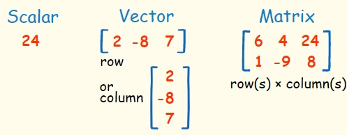
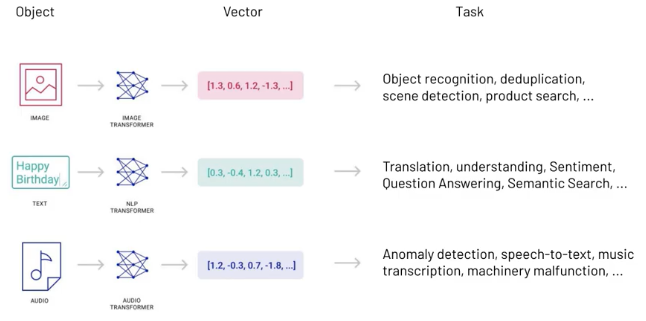

# Weavite

## Overview
- Weaviate is an open source & low-latency `vector database` that stores both objects and vectors.
- It stores and retrieve data objects based on their semantic properties by indexing them with vectors.
- It can be used stand-alone (aka bring your vectors) or with a variety of modules that can do the vectorization for you and extend the core capabilities.
- It offers Semantic Search, Question-Answer Extraction, Classification, Customizable Models (PyTorch/TensorFlow/Keras), etc.
- Built from scratch in Go.
- It is a cloud-native database.
- It is all accessible through GraphQL, REST, and various client-side programming languages.

## Acronyms
- `Vector DB`
  - Relational Databases designed couple of decades ago work with structured data, using features like primary keys, tables (rows and columns). This has inability to scale horizontally to support increasing workloads.
  - NoSQL database work with semi-structured and unstructured data. They come in the form of the document store, key-value store, graph database, and column-oriented DB. They have ability to scale horizontally.
  - A vector is a list of numbers represented as a sequence of numbers or as a single value in a row and a single value in the column section.
  
  - They stores data such as text, image, and audio in the form of vectors.
  
  
  - This type of DB can't find a 100% match, but it will find a very close one, and return the result.
  - Vector indexing mechanisms is the core to represent the data.

- `Vector Embeddings` 
   - Embeddings are vectors or arrays of numbers that represent the meaning and the context of tokens processed by the model.
   - It capture the meaning and context of data, usually predicted by Machine Learning models.
   - At the time of entry/import or 

- `Vector Search`
  - 

- `Modules:`
  - Used to extend Weaviate core capabilities and are optional.
  - They are used to automatically vectorize your content (i.e., *2vec).
  - Add support to new type of vectors.

## Reference
- [Analyticsvidhya Overview](https://www.analyticsvidhya.com/blog/2022/02/weaviate-towards-the-new-era-of-vector-search-engines/)