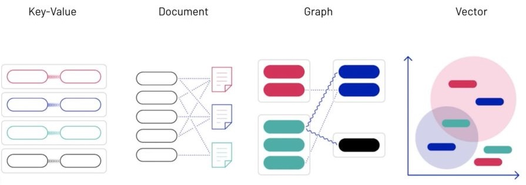

# Weavite

## Overview
- Weaviate is an open source & low-latency `vector database` that stores both objects and vectors.
- It uses machine learning to vectorize and store data and find responses to natural language questions.
- Supports to store actual data like media, text, images and their corresponding vectors, allowing for combining search via Syntactic & Sematic.
- It stores and retrieve data objects based on their semantic properties by indexing them with vectors.
- It can be used stand-alone (aka bring your vectors) or with a variety of modules that can do the vectorization for you and extend the core capabilities.
- It offers Semantic Search, Question-Answer Extraction, Classification, Customizable Models (PyTorch/TensorFlow/Keras), etc.
- Built from scratch in Go.
- It is a cloud-native database.
- It is all accessible through GraphQL, REST, and various client-side programming languages.

## Acronyms
- `Search`
  - `Syntactic`: This is the conventional serach that we perform on regular database using like, where etc.. based upon the actual words.
  - `Semantic`: This is a way of understanding what a user is really looking for, and providing them with the most relevant results possible.
- `Vector DB`
  - `Relational Databases [RDBMS]` designed couple of decades ago work with structured data, using features like primary keys, tables (rows and columns). This has inability to scale horizontally to support increasing workloads.
  - `NoSQL` database work with semi-structured and unstructured data. They come in the form of the document store, key-value store, graph database, and column-oriented DB. They have ability to scale horizontally.
  - `Graph DB` is also a special type of database that stores data in the form of nodes connected with relationships. Nodes and relationships are fundamental components that are used. Labels and properties are often included because of the added functionalities they offer. Its building blocks are:
    - Nodes: The main entities in a graph. They are also sometimes referred to as vertices or points.
    - Relationships: The connections between those entities. Sometimes they are referred to as edges or links.
    - Labels: Attributes that group similar nodes together.
    - Properties: key/value pairs stored within nodes or relationships.
      
  - We are in the mids of `next revolution - AI revolution`. Every industry will be touched and impacted by AI. `Vector DB` is the next DB technology that is used to store and search the artifcats of AI.
    - A vector is a list of numbers represented as a sequence of numbers or as a single value in a row and a single value in the column section.
      
    - AI & ML models store data such as text, image, and audio in the form of vectors.
      
    - Vector DB will act as catlyst to work with these kind of artifatcs - Vectors.
    - This type of DB on contrary to conventional DB can't find a 100% match, but it will find a very close one, and return the result.
    - Vector indexing mechanisms is the core to represent and search data.
  
    

- `Vector Embeddings` 
   - Embeddings are vectors or arrays of numbers that represent the meaning and the context of tokens processed by the model.
   - It capture the meaning and context of data, usually predicted by Machine Learning models.
   - At the time of entry/import or 

- `Vector Search`
  - 

- `Modules:`
  - Used to extend Weaviate core capabilities and are optional.
  - They are used to automatically vectorize your content (i.e., *2vec).
  - Add support to new type of vectors.

## Reference
- [Analyticsvidhya Overview](https://www.analyticsvidhya.com/blog/2022/02/weaviate-towards-the-new-era-of-vector-search-engines/)