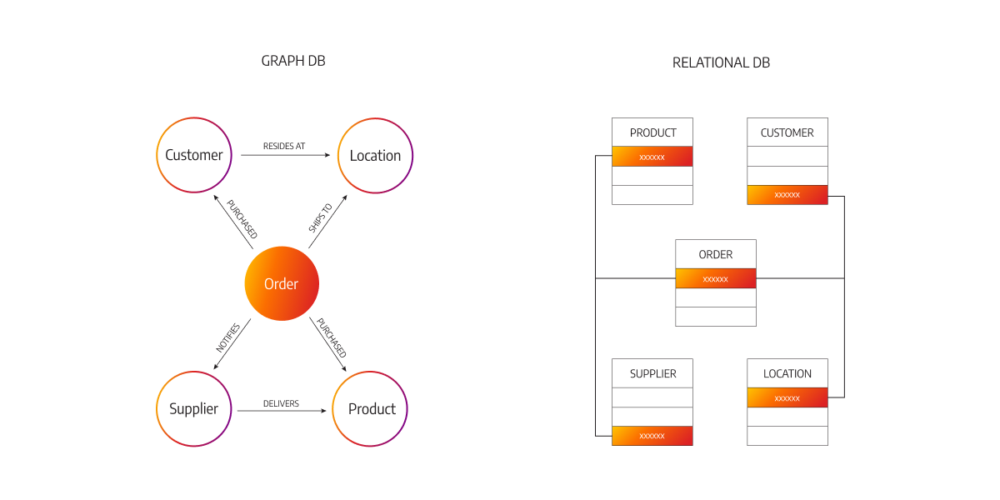
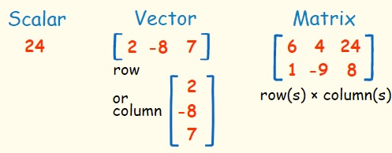
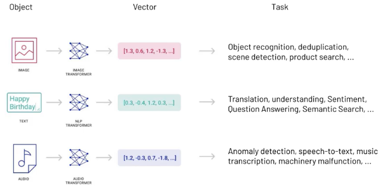

# Weavite

## Overview
- Weaviate is an open source & low-latency `vector database` that stores both objects and vectors.
- It uses machine learning to vectorize and store data and find responses to natural language questions.
- Supports to store actual data like media, text, images and their corresponding vectors, allowing for combining search via Syntactic & Sematic.
- It stores and retrieve data objects based on their semantic properties by indexing them with vectors.
- It can be used stand-alone (aka bring your vectors) or with a variety of modules that can do the vectorization for you and extend the core capabilities.
- It offers Semantic Search, Question-Answer Extraction, Classification, Customizable Models (PyTorch/TensorFlow/Keras), etc.
- Built from scratch in Go.
- It is a cloud-native database.
- It is all accessible through GraphQL, REST, and various client-side programming languages.

## Architecture
- 

## Acronyms
- **Search:**
  - *Syntactic:* This is the conventional serach that we perform on regular database using like, where etc.. based upon the actual words.
  - *Semantic:* This is a way of understanding what a user is really looking for, and providing them with the most relevant results possible.
- **Vector DB:**
  - `Relational Databases [RDBMS]` designed couple of decades ago work with structured data, using features like primary keys, tables (rows and columns). This has inability to scale horizontally to support increasing workloads.
  - `NoSQL` database work with semi-structured and unstructured data. They come in the form of the document store, key-value store, graph database, and column-oriented DB. They have ability to scale horizontally.
  - `Graph DB` is also a special type of database that stores data in the form of nodes connected with relationships. The building blocks of this DB are below:
    - `Nodes:` The main entities in a graph. They are also sometimes referred to as vertices or points.
    - `Relationships:` The connections between those entities. Sometimes they are referred to as edges or links.
    - `Labels:` Attributes that group similar nodes together.
    - `Properties:` key/value pairs stored within nodes or relationships.
      
    
      `Nodes` and `relationships` are fundamental components of this technology. `Labels` and `properties` are often included because of the added functionalities they offer.
  - We are in the mids of `next revolution - AI revolution`. Every industry will be touched and impacted by AI. `Vector DB` is the next DB technology that is used to store and search the artefcats of AI.
    - A vector is a list of numbers represented as a sequence of numbers or as a single value in a row and a single value in the column section.
      
    - AI & ML models store data such as text, image, and audio in the form of vectors.
      
    - Vector DB will act as catlyst to work with these kind of artefatcs - Vectors.
    - This type of DB on contrary to conventional DB can't find a 100% match, but it will find a very close one, and return the result.
    - Vector indexing mechanisms is the core to represent and search data.
  
    

- **Vector Indexing:**

- **Vector Embeddings:**
   - Embeddings are vectors or arrays of numbers that represent the meaning and the context of tokens processed by the model.
   - It capture the meaning and context of data, usually predicted by Machine Learning models.
   - At the time of entry/import or 

- **Vector Search:**
  - 

- **Modules:**
  - Used to extend Weaviate core capabilities and are optional.
  - They are used to automatically vectorize your content (i.e., *2vec).
  - Add support to new type of vectors.

## Reference
- [Analyticsvidhya Overview](https://www.analyticsvidhya.com/blog/2022/02/weaviate-towards-the-new-era-of-vector-search-engines/)
- [Pinecone - What is a Vector Database?](https://www.pinecone.io/learn/vector-database/#:~:text=Vector%20databases%20are%20purpose%2Dbuilt,vector%20embeddings%20in%20production%20scenarios.)