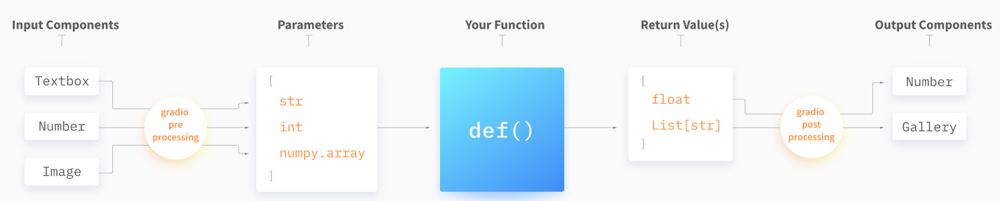

# Gradio

## Overview
- Gradio is an open-source Python library that is used to build machine learning and data science demos and web applications.
- Gradio offers two classes to build apps:
  - **Interface:** It provides a high-level abstraction.
    - This class can wrap any Python function with a user interface. It accepts below parameters
       - **fn:** Python function to wrap a UI around
       - **inputs:** Input component(s) (e.g. "text", "image" or      "audio")
       - **outputs:** Output component(s) (e.g. "text", "image" or      "label")
  - **Blocks:** A low-level API for designing web apps with more flexible layouts and data flows. 
    - It allows to do things like feature multiple data flows and demos, control where components appear on the page, handle complex data flows (e.g. outputs can serve as inputs to other functions), and update properties/visibility of components based on user interaction — still all in Python.
- Gradio includes `pre-built components` that can be used as inputs or outputs in your Interface or Blocks with a single line of code.
  - Components include processing steps:
    - **Preprocessing:** Convert user data submitted through browser to something that be can used by a Python function.
    - **Postprocessing:** Convert values returned by a Python function into something that can be displayed in a browser.
    

## Installation
- Gradio requires Python 3.7 or higher.
- Steps to execute hello world
  ```bash
  cd 02-modules/05-gradio
  pip  install -r requirements.txt
  python hello.py
  ```
- System will create [URL]( http://localhost:7860/), [Dark Theme URL]( http://localhost:7860/?__theme=dark)