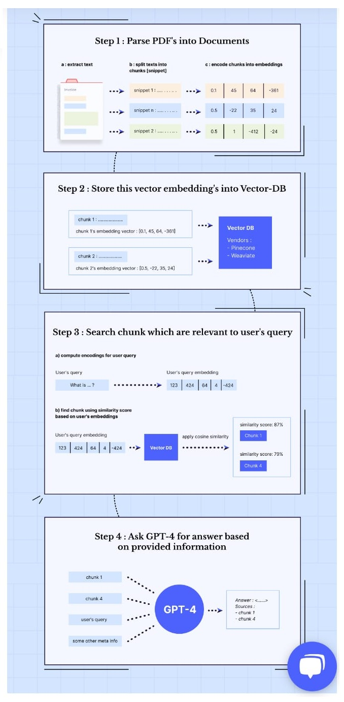

# ChatGPT

## Overview
- ChatGPT is a specific type of `machine learning model` that has been trained on a massive amount of text data, in order to be able to generate human-like responses to text-based inputs.
- ChatGPT uses a technique called `unsupervised learning`, meaning that it can learn patterns and relationships in the data without being explicitly told what to look for.
- ChatGPT `Large language models(LLM)` is typically based on `deep learning algorithms` where model is trained to understand and generate natural language .It require a significant amount of computing power and data to be trained effectively. Example Google's BERT, and Facebook's RoBERTa, OpenAI GPT series (such as GPT-3/4).
- `Large Language Model (LLM) AI` is a term that refers to AI models that can generate natural language texts from large amounts of data. These models can also perform various natural language tasks, such as classification, summarization, translation, generation, and dialogue.

## Examples
- As part of this demo we will try to create an example to help ChatGPT to provide information about Customer 360 for Underwriter.
  - [Extraction](./02-dev/01-extraction/extraction.md)
    - CSV
    - Excel
    - PDF
  - [Langchain](./02-dev/02-langchain/langchain.md)
  - Vector DB
    - [FAISS](./02-dev/03-weaviate/faiss.md)
    - [ChromaDB](./02-dev/03-weaviate/chroma.md)
    - [Weaviate DB](./02-dev/03-weaviate/weavite.md)
  - LLM
    - [Prompting](./02-dev/04-llm/prompting.md)
    - [OpenAI](./02-dev/04-llm/openai.md)
    - [Huggingface](./02-dev/04-llm/hugginface.md)
    - [Cohere](./02-dev/04-llm/cohere.md)
    - [GPT4All](./02-dev/04-llm/gpt4all.md)
  - [Gradio](./02-dev/05-gradio/gradio.md)

  

## Reference
- [Youtube - ChatGPT for YOUR OWN PDF](https://www.youtube.com/watch?v=TLf90ipMzfE)
- [Youtube - Chat With Multiple PDF Files](https://youtu.be/Ix9WIZpArm0)
- [Youtube - ChatGPT work with your enterprise data](https://www.youtube.com/watch?v=tW2EA4aZ_YQ)
- [Youtube - LangChain101: Question A 300 Page Book](https://www.youtube.com/watch?v=h0DHDp1FbmQ)